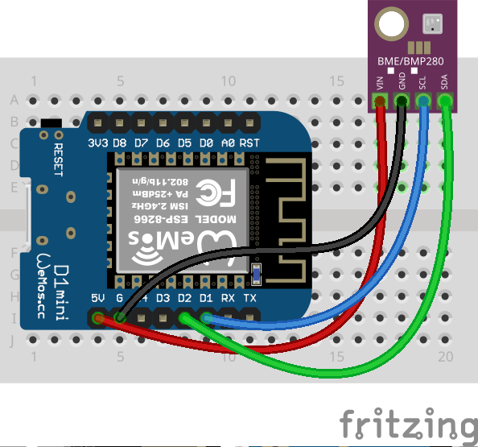

# thpa-sensor

`thpa-sensor` is very simple temperature/humidity/pressure/altitude sensor code
for arduino. It just pull data from a BME280 sensor and send it to a MQTT
server.


## Wiring



Connect the BME280 sensor using I2C.

## Build

To build the project you have to provide a `secrets.h` header file with the
following:

```c
#define SECRET_WIFI_SSID ("your SSID")
#define SECRET_WIFI_PASSWORD ("the wifi password")
#define SECRET_MQTT_HOST ("MQTT host")
#define SECRET_MQTT_PORT (8883)
#define SECRET_MQTT_USER ("your mqtt user")
#define SECRET_MQTT_PASSWORD ("mqtt password")
#define SECRET_FINGERPRINT ("SHA1 fingerprint of the TLS certificate used")
#define SECRET_MQTT_TOPIC ("the/topic/where/to/send/data")
#define SECRET_MQTT_CLIENT_ID ("client id")
```
